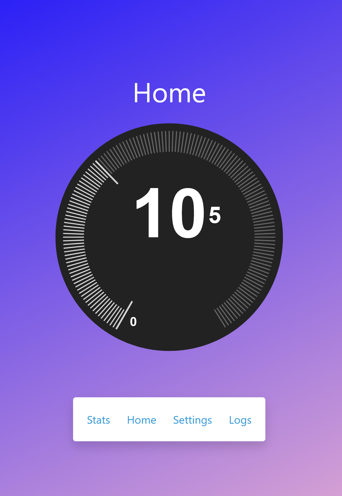
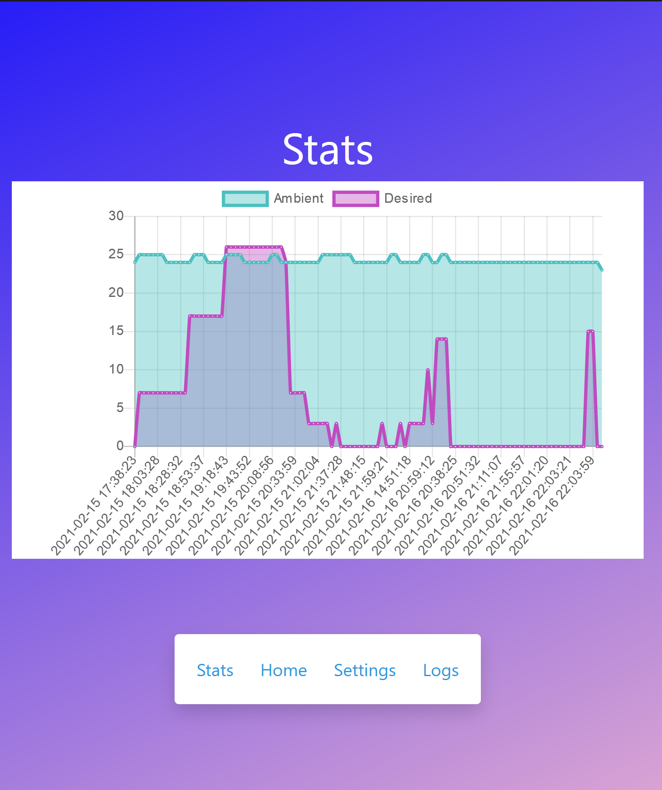
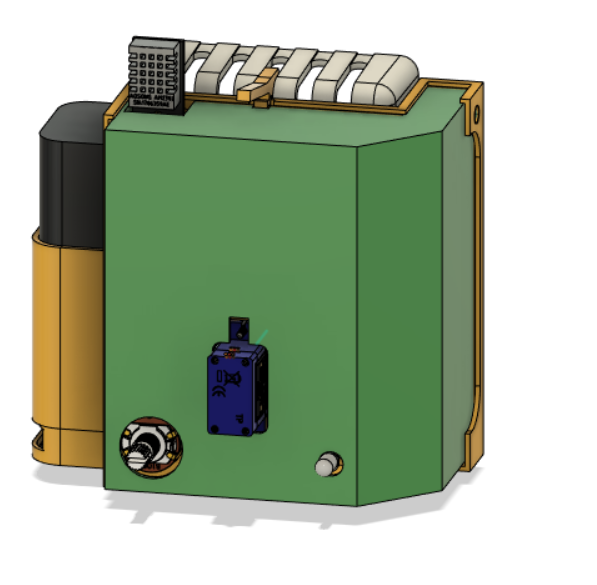
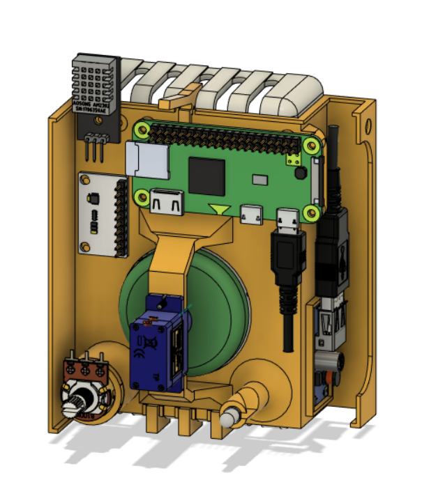
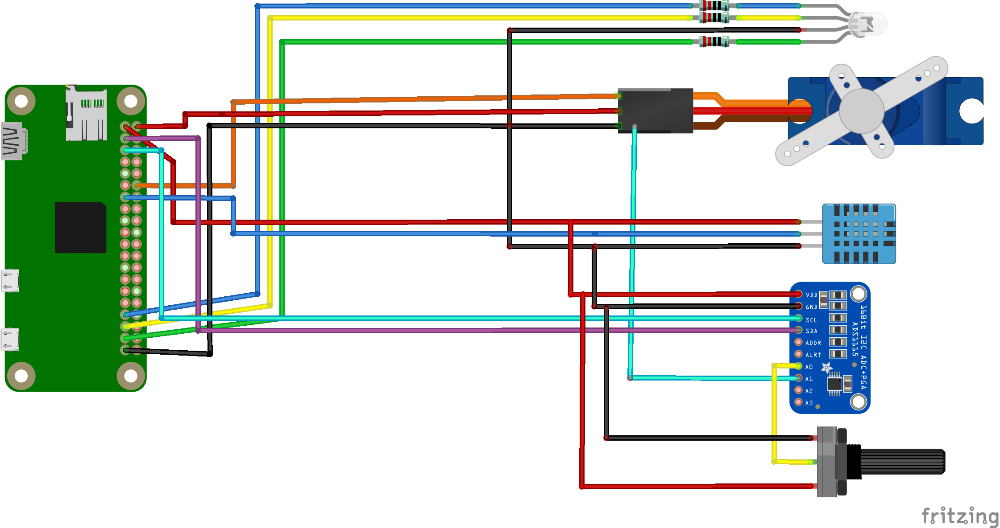
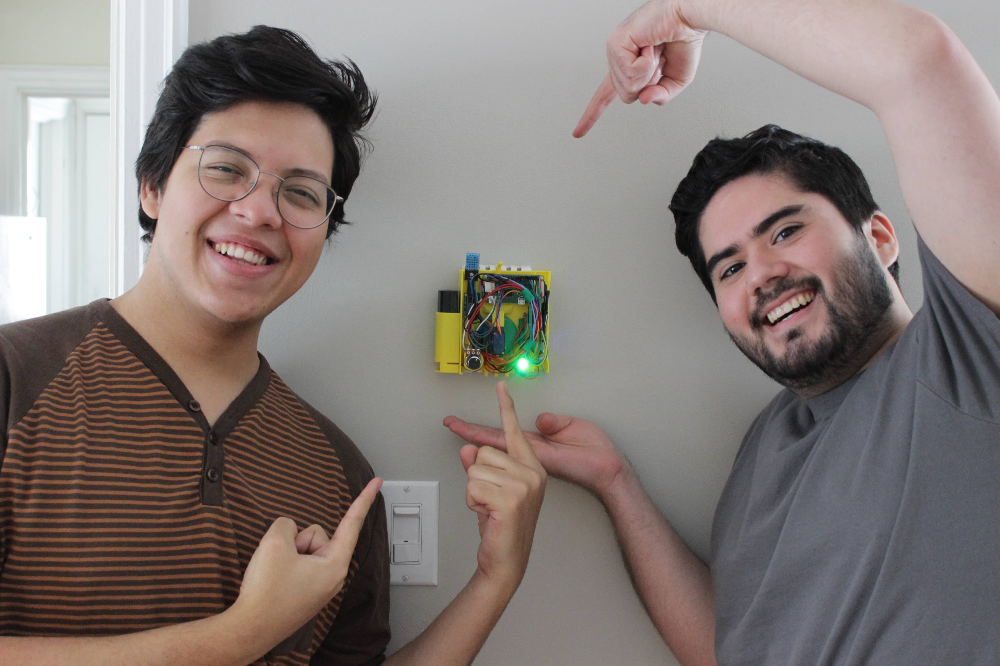

# KAFA - Thermostat Enhancer (Overall 1st Place Winner, MakeUofT 2021)
## Description
Authors: Kovasky Buezo and Fernando Saenz

This project was built during our free time for MakeUofT 2021. The goal was to create a plug and play thermostat enhancer, one that does not need installation nor guidance from an expert.

The piwebapp folder corresponding source files that are used to build the docker image to be run on a raspberry pi. The uiwebapp folder contains the corresponding source files that are used to build the docker image to be run on the frontend server. For database, we used a prebuilt docker image from dockerhub. The cad folder contains the stl files used to 3D print the housing.

## Screenshots

<table style="table-layout: fixed;text-align:center;">
    <tr>
        <td></td>
        <td></td>
    </tr>
</table>

<table style="table-layout: fixed; text-align:center;">
  <tr>
    <td></td>
    <td></td>
  </tr>
</table>

<table style="table-layout: fixed; text-align:center;">
  <tr>
    <td></td>
    <td></td>
  </tr>
</table>

## License

This project is licensed under the MIT License - see the LICENSE.md file for details

## Acknowledgments
* [docker-alpine-pigpiod - zinen](https://github.com/zinen/docker-alpine-pigpiod)
* [Nest Thermostat Control - Dal Hundal](https://codepen.io/dalhundal/pen/KpabZB)
* [Raspberry Pi Zero W board - Vittorinco](https://grabcad.com/library/raspberry-pi-zero-w-board-1)
* [USB Cable - 3D-2D CAD Design](https://grabcad.com/library/usb-cable-31)
* [Micro USB Plug - Yuri Malina](https://grabcad.com/library/micro-usb-plug-1)
* [5V-USB-Booster - Erick Robles](https://grabcad.com/library/5v-usb-booster-1)
* [Standard Through Hole Potentiometer (Vertical & Horizontal) - Abel Villanueva](https://grabcad.com/library/standard-through-hole-potentiometer-vertical-horizontal-1)
* [SG90 - Micro Servo 9g - Tower Pro - Matheus Frasson](https://grabcad.com/library/sg90-micro-servo-9g-tower-pro-1)
* [Volume Control Rotary Knobs - Kevin Yu](https://grabcad.com/library/volume-control-rotary-knobs-1)
* [Led RGB 5mm - Terrapon Théophile](https://grabcad.com/library/led-rgb-5mm)
* [Pin Headers single row - singlefonts](https://grabcad.com/library/pin-headers-single-row-1)
* [GY-ADS1115 - jalba](https://grabcad.com/library/gy-ads1115-1)
